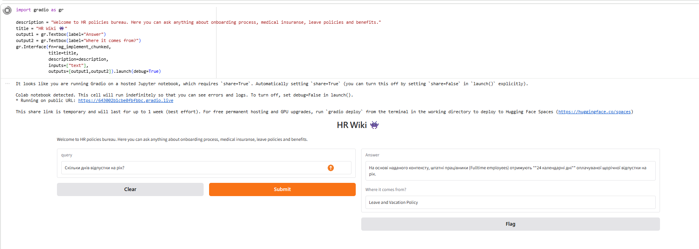
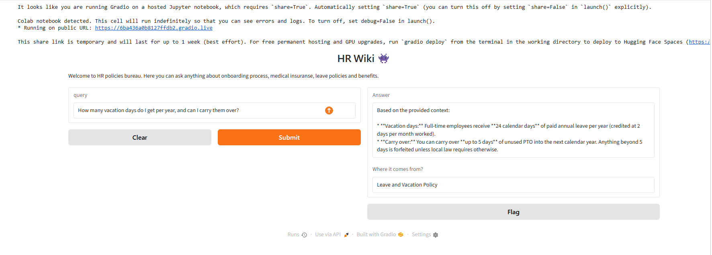
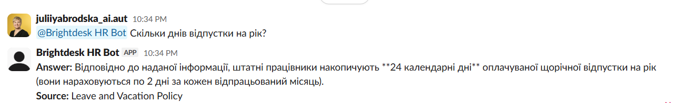
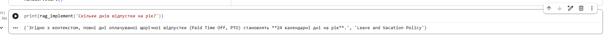
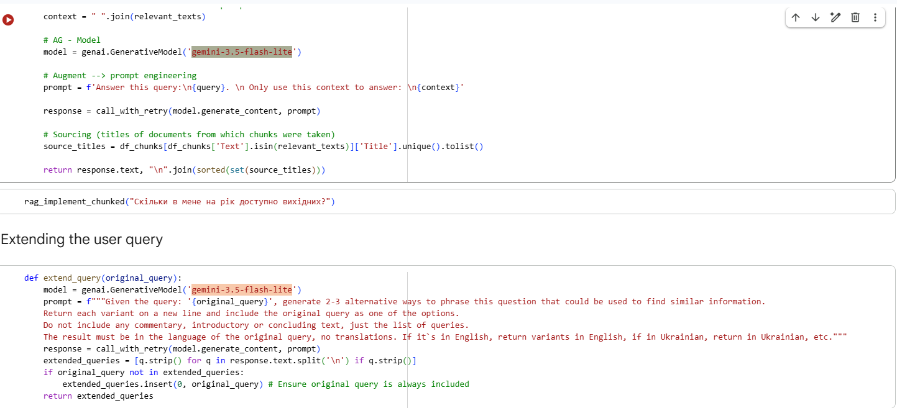

# Brightdesk HR Knowledge Assistant (RAG)

A retrieval-augmented chatbot that lets employees ask HR questions in plain language and get an accurate answer pulled straight from the company's own policy documents, with the source cited — instead of digging through PDFs.

> **Note:** "Brightdesk" is a fictional company built for this demo. The HR policy documents in `docs/` are synthetic, written specifically to showcase the retrieval pipeline — not real client data.

[](https://colab.research.google.com/github/juliiyabrodska-tech/brightdesk-hr-rag/blob/main/Brightdesk_HR_RAG_demo.ipynb)

Click the badge above to open and run the notebook yourself (you'll need your own free Gemini API key — see **Running it yourself** below). The core retrieval calls have real, committed output right in the notebook, so you can read those without running anything; the Gradio and Slack paths are documented with the screenshots below instead (see **Tested**).

## Screenshots

| Gradio UI (Ukrainian) | Gradio UI (English) |
|---|---|
|  |  |

| Slack bot | Console — positive case |
|---|---|
|  |  |

| Console — negative case |
|---|
|  |

## How it works

```
HR policy docs (docs/*.md)
        |
        v
sentence-aware chunking, with overlap (Cyrillic + Latin safe)
        |
        v
each chunk embedded with Gemini (gemini-embedding-001)
        |
        v
employee question -> expanded into 2-3 alternate phrasings (query expansion)
        |
        v
most relevant chunks retrieved by cosine similarity
        |
        v
Gemini generates an answer restricted to the retrieved context only
        |
        v
answer + source document name returned, through a Gradio chat UI (or the Slack demo below)
```

## Features

- **Multilingual retrieval** — built for teams that work across languages: an international company with a bilingual team can have policies written in one language and still get accurate answers in another. Tested with both an English and a Ukrainian question, both correctly grounded in the same (English-language) source policy — see **Tested**
- **Query expansion** — differently-worded questions ("How many vacation days do I get?" vs "What's the PTO policy?") still find the right document
- **Grounded answers only** — every answer is generated from retrieved text, with the source document cited, not a free-floating model guess
- **Chunking with overlap** — answers aren't cut off mid-context
- **Retry on transient errors** — Gemini API calls retry automatically on rate limits / temporary overload (503/429) instead of failing silently
- **Slack demo** — a one-off Socket Mode bot (last section of the notebook) that answers questions in a single designated Slack channel; confirmed working (see **Tested** and the screenshot above), but it's a temporary demo you run yourself, not a deployed service — see the note in **Tested**

## Tested

Run end-to-end (chunking -> embedding -> retrieval -> query expansion -> grounded generation) on `gemini-3.5-flash-lite`, with the real output committed in the notebook:

- **Positive case, Ukrainian** (`"Скільки днів відпустки на рік?"`) -- correctly retrieved and cited `Leave and Vacation Policy`, answered "24 календарні дні на рік" (matches the source document). Confirmed through three separate paths: the plain console call (`rag_implement`), the chunked retrieval path the Gradio UI actually calls (`rag_implement_chunked`), and the Slack bot (`rag_implement_chunked_extended`, adds query expansion) — see screenshots above.
- **Positive case, English** (`"How many vacation days do I get per year, and can I carry them over?"`) -- via the Gradio UI (`rag_implement_chunked`): correctly answered 24 calendar days (2 per month worked) and correctly added the carry-over rule (up to 5 days into the next year) — both details pulled from the same `Leave and Vacation Policy` document, not invented.
- **Negative case** (`"А чи є курси німецької?"`) -- correctly reported no matching policy exists, instead of guessing an answer (console, via `rag_implement`).

Note on the free tier: Google's Gemini free tier enforces a low per-minute request cap (the account used for this demo hit `limit: 5` requests/minute on `gemini-3.5-flash`, and `limit: 20` on later runs). Since query expansion generates 2-3 rephrasings plus a final generation call, a single question can use up several of those requests — asking the Slack bot or Gradio UI several questions in a row can hit that cap. The notebook's `call_with_retry` helper retries transient `503`/`429` errors automatically, and the Slack bot replies with a plain "try again in a moment" message instead of crashing when that happens; a sustained cap needs either a short wait or switching the `MODEL_NAME` constant to a lighter model.

## Running it yourself

1. Open the notebook (badge above, or `Brightdesk_HR_RAG_demo.ipynb` directly)
2. Get a free Gemini API key from [Google AI Studio](https://aistudio.google.com/app/apikey)
3. In Colab: Secrets (key icon in the sidebar) -> add `GOOGLE_API_KEY` with that value, enable notebook access
4. Runtime -> Run all
5. Optional: to also try the Slack demo, see the setup instructions in the notebook's last section

## Tech

Google Gemini (embeddings + generation) - Python - pandas / numpy - Gradio - Slack Bolt (Socket Mode, for the Slack demo)

## Project structure

```
.
|-- Brightdesk_HR_RAG_demo.ipynb   # main notebook, runs end-to-end
|-- docs/                          # synthetic HR policy documents (source data)
|-- screenshots/                   # portfolio screenshots (Gradio, Slack, console runs, repo)
|-- requirements.txt
|-- LICENSE
```

## Limitations (by design, for a demo of this scope)

- Retrieval is a custom in-memory cosine-similarity search (numpy/pandas), not a dedicated vector database — fine at this scale, would swap in something like Chroma or pgvector for a larger document set
- No fine-tuning — this is prompt-grounded RAG
- Runs in Colab, not deployed as a persistent service; the Slack bot is a temporary Socket Mode connection you start and stop yourself, not a hosted bot
